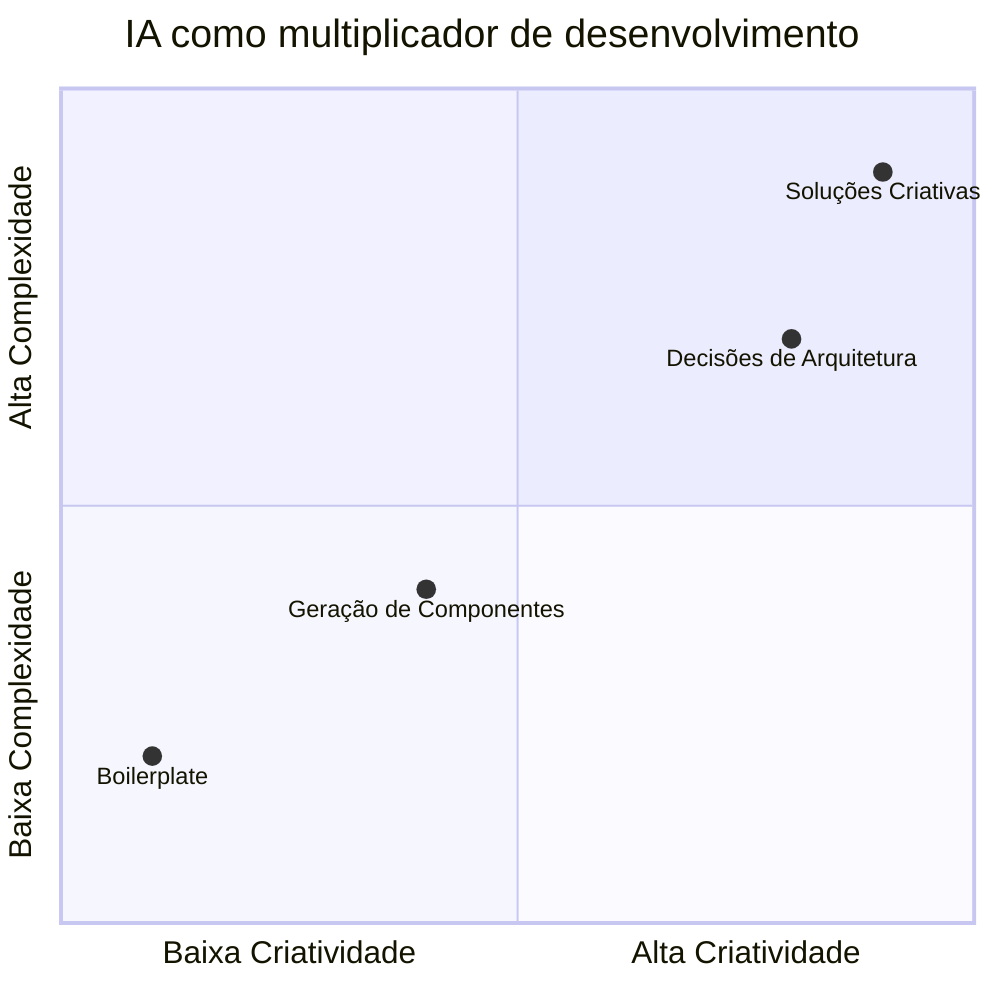

<div align="center">


<br/><br/>


</div>

---

## 🧠 The AI-Assisted Developer

> **Human judgment first. AI as a multiplier — not a crutch.**

Sou um desenvolvedor focado em **frontend moderno**, usando IA como **acelerador de produtividade**, mantendo **decisões arquiteturais, qualidade e responsabilidade técnica humanas**.

---

## 🤖 Como uso IA no desenvolvimento



---

## ⚡ Tech Stack & Workflow

| Área        | IA Apoia            | Minha Responsabilidade     | Resultado               |
| ----------- | ------------------- | -------------------------- | ----------------------- |
| UI/UX       | Sugestão de padrões | Curadoria visual           | Interfaces consistentes |
| Código      | Boilerplate         | Arquitetura e legibilidade | Código limpo            |
| Testes      | Casos iniciais      | Validação real             | Confiança               |
| Performance | Análise             | Otimização manual          | Apps rápidos            |
| Tooling     | Setup inicial       | Ajustes finos              | Fluxo eficiente         |

---

## 🛠️ Stack Técnica

### Core

```ts
const stack = {
  language: "TypeScript",
  framework: "React",
  styling: "Tailwind CSS",
  build: "Vite",
  deploy: "Vercel",
  container: "Docker"
}
```

### Conceitos que aplico

* Componentização real
* Separação de responsabilidades
* Design system básico
* CI honesto (sem green fake)
* Docker para padronização de ambiente

---

## 🌟 Projetos em Destaque

### 🔹 Meu Software Customizado

**Aplicação frontend moderna**

* Tech: React + TypeScript + Vite
* CI com GitHub Actions
* Docker para ambiente previsível
* Deploy automatizado
* Foco em qualidade, não aparência

🔗 **Live:** https://meu-software-customizado.vercel.app

---

## 📦 Filosofia de Engenharia

* ❌ CI verde sem propósito → **não faço**
* ✅ Ferramentas existem para **servir o projeto**
* ✅ Simplicidade > hype
* ✅ Infra só quando agrega valor

> *“A melhor automação é a que resolve um problema real.”*

---

## 🌐 Contato

<div align="center">

<a href="https://github.com/leorecoa">
  
</a>

<a href="https://www.linkedin.com">
  
</a>

</div>

---

<sub>🚀 Construindo software com responsabilidade técnica e IA como aliada.</sub>